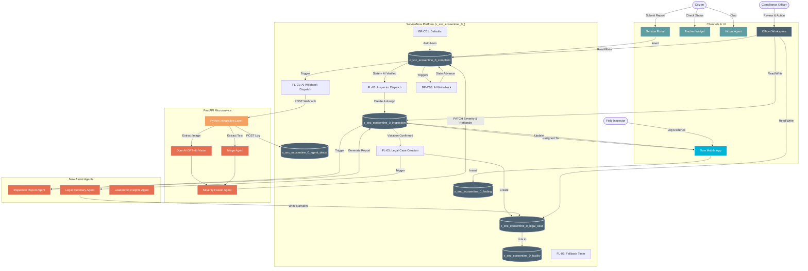

# EcoSentinel AI — System Architecture Diagram

> **Scoped Application**: EcoSentinel AI  
> **Scope Prefix**: `x_snc_ecosentine_0_`  
> **Hackathon**: ServiceNow × Deloitte 2026 — Team VertexNow

---

## 1. High-Level Architecture

The following diagram illustrates the end-to-end data flow from the citizen reporting an incident to the AI processing it, and finally to the field inspector and legal compliance team resolving the issue.

## 2. Component Breakdown

* **Channels**: Citizens report incidents via the **Service Portal** (PWA). Inspectors execute fieldwork via **Now Mobile**. Officers and Legal Handlers manage the backend via the **Officer Workspace**.
* **AI Integration**: The platform offloads complex multi-modal reasoning to an external **FastAPI Microservice** which orchestrates OpenAI's **GPT-4o Vision API** for photo analysis and LLMs for text triage. 
* **Native AI Agents**: ServiceNow's native **AI Agent Studio** is used for structured internal tasks like summarizing inspection reports and drafting legal narratives.
* **Core Tables**: 
  * `x_snc_ecosentine_0_complaint` (Intake)
  * `x_snc_ecosentine_0_inspection` & `x_snc_ecosentine_0_finding` (Fieldwork)
  * `x_snc_ecosentine_0_legal_case` (Enforcement)
  * `x_snc_ecosentine_0_facility` (Compliance Registry)
  * `x_snc_ecosentine_0_agent_decisi` (Immutable Audit Trail)
* **Automation**: Flow Designer handles all asynchronous routing, SLAs, fallback timers, and citizen notifications. Business Rules enforce immutability, state regression blocks, and synchronous data validation.
